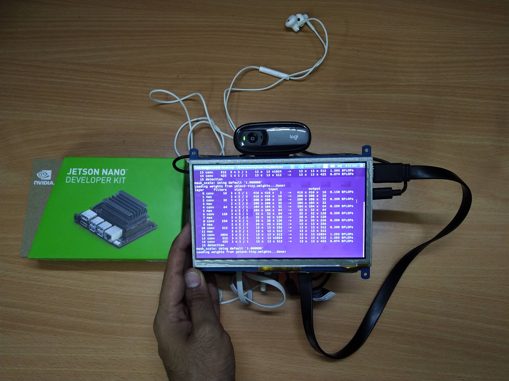
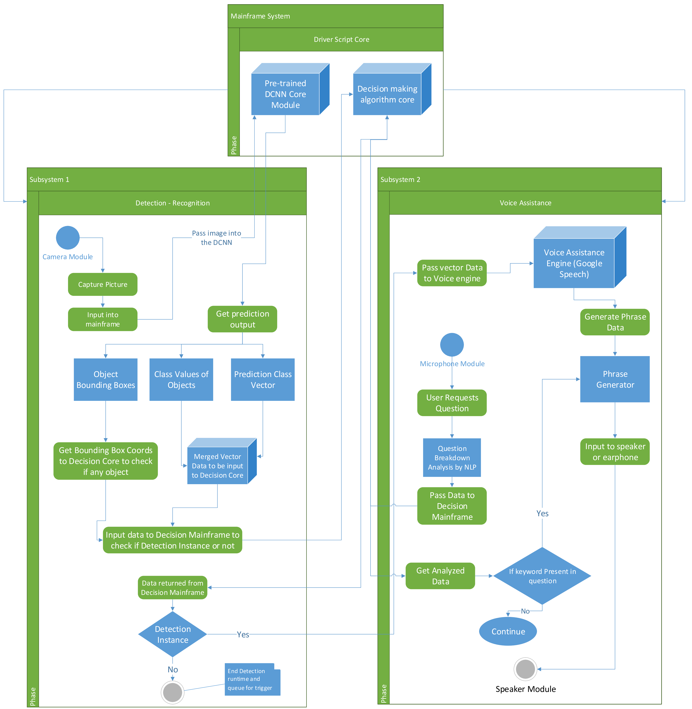

# Aiding the Blind: Real-Time Vision Processing and Voice Assistance

This project introduces a standalone device designed to assist visually impaired individuals with indoor navigation and object recognition. Built around the NVIDIA Jetson Nano, it combines real-time vision processing, proximity estimation, and voice-based natural language assistance to provide users with an interactive and reliable tool for everyday tasks.




This device represents a cost-effective, robust solution to empower the visually impaired with greater independence and confidence in navigating their surroundings.

## Motivation
Navigating and performing everyday tasks independently can be highly challenging for individuals with partial or total vision loss. Current solutions, such as smart canes and wearables, often rely on sensors with auditory or haptic feedback systems that are limited in reliability, especially in crowded areas where frequent triggers can confuse users. These solutions lack the standalone capabilities and nuanced interactivity of human assistance. The BlindAid project seeks to bridge this gap by providing a fully offline, standalone device that uses real-time vision processing, natural language voice interaction, and reinforcement learning to assist visually impaired individuals effectively and reliably.

## Design
•	Standalone Device: Built around the NVIDIA Jetson Nano, the device operates offline, eliminating reliance on server-based computations.

•	Interactive Voice Assistance: A consent-based voice interaction system provides context-aware feedback and responds to user queries (e.g., “What is around me?” or “Find the bottle”).

•	Proximity Estimation: Object proximity is calculated using changes in bounding box areas from real-time image processing rather than relying on additional depth sensors.

•	Optimized Neural Network: The YOLO-based algorithm has been modified for efficiency on low-powered GPUs, such as the NVIDIA Tegra X1, enabling faster and energy-efficient object detection.

•	Reinforcement Learning: The device uses reinforcement learning to adapt to frequently encountered objects, improving detection accuracy over time.




## Tools Used
####	Hardware:
•	NVIDIA Jetson Nano: Integrated with a camera and microphone for image and audio processing, featuring a Maxwell Architecture Tegra X1 GPU with 128 CUDA cores.

•	Camera: Captures real-time images for object detection.

•	Microphone and Speaker: Facilitate interactive voice input and output.

####	Software:
•	Darknet YOLO Framework: For real-time object detection.

•	Python Libraries:

•	pyttsx3 and SpeechRecognition for voice synthesis and recognition.

•	OpenCV for image processing.

•	NVIDIA CUDNN: For optimized neural network operations.

•	Google NLTK: Natural Language Toolkit for voice interaction.

####	Optimization Techniques:
•	Modified YOLO algorithm tailored to low-powered GPUs.

•	Single-pass neural networks and detection cycles for efficiency.

## Contributions
[Sai Nikhil]{https://github.com/TakedoNick}

[Prawigya Pariyar]{https://www.prawigya.com/}

## Citations
```
@article{alisettiguiding,
  title={Guiding and Navigation for the Blind using Deep Convolutional Neural Network Based Predictive Object Tracking},
  author={Alisetti, Sai Nikhil and Purushotham, Swarnalatha and Mahtani, Lav}
}
```
